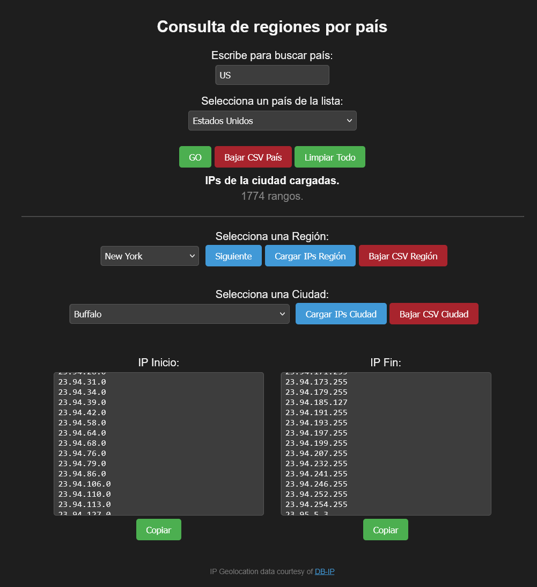

# Local IP Geolocation Explorer 🌍

Una utilidad web local, rápida y portable diseñada para explorar, filtrar y exportar rangos de direcciones IPv4 por países, regiones y ciudades utilizando bases de datos públicas de **DB-IP**. 

La aplicación está optimizada para ejecutarse en navegadores modernos (como Firefox o Chrome) directamente desde un disco local o unidad USB, cargando millones de registros en memoria de forma eficiente sin necesidad de dependencias de servidor o acceso a Internet.

## ✨ Características

- **Carga Eficiente en Memoria:** Lee archivos CSV pesados (+200 MB) en una sola tanda mediante flujos optimizados de JavaScript (`ReadableStream`).
- **Filtrado Instantáneo:** Búsqueda en tiempo real por País, Región y Ciudad sin recargas de página.
- **Exportación Versátil:** Permite copiar los rangos de IP iniciales y finales al portapapeles o descargarlos como archivos `.csv` segmentados de forma independiente.
- **Interfaz Adaptable:** Incluye un **Modo Oscuro** integrado para mejorar la legibilidad y reducir la fatiga visual.
- **Buscador Predictivo:** Autocompletado rápido al escribir los primeros caracteres o el código ISO de un país.

---

## 🚀 Guía de Instalación y Configuración

Dado que el proyecto está diseñado bajo un modelo de privacidad local, **los datos de geolocalización no vienen incluidos de forma predeterminada**. Sigue estos sencillos pasos para ponerlo en marcha:

### 1. Clonar o descargar el proyecto
Descarga los archivos del repositorio y colócalos en una carpeta en tu ordenador o memoria USB.

### 2. Estructura de directorios
Asegúrate de que la estructura interna de tus archivos se vea de la siguiente manera:
```text
├── index.htm
└── csv/
    └── datos.csv  <-- (Aquí irá la base de datos)
```

### 3. Obtener la Base de Datos
- Visita el sitio web oficial de DB-IP: [DB-IP IP to City Lite](https://db-ip.com/db/download/ip-to-city-lite).
- Marca la casilla "I agree with the licensing terms".
- Descarga la versión gratuita en formato CSV.
- Descomprime el archivo descargado.
- Renombra el archivo .csv resultante a datos.csv y muévelo dentro de la carpeta csv/.

⚠️ Nota Crítica de Rendimiento: La base de datos contiene millones de registros. Asegúrate de utilizar la versión Lite y que el nombre sea exactamente datos.csv (en minúsculas) para que la aplicación lo detecte correctamente.

---

## 🛠️ Modo de Uso

* Abre el archivo index.htm en tu navegador web preferido.
* Comienza a escribir el nombre del país o su código de dos letras (por ejemplo: ES o España) en la barra de búsqueda superior.
* Haz clic en el botón GO. La primera vez, se mostrará una barra de progreso mientras los datos se cargan desde tu disco duro hacia la memoria.
* Una vez completado, podrás desplegar las regiones, ciudades y cargar o descargar los listados de IPs resultantes de forma instantánea.



---

## ⚖️ Licencia y Atribución

Este proyecto es de código abierto y utiliza datos públicos. De acuerdo con los términos de uso de la base de datos utilizada:
* Los datos de geolocalización IP son provistos por cortesía de DB-IP y están bajo la licencia Creative Commons Attribution 4.0 International License.